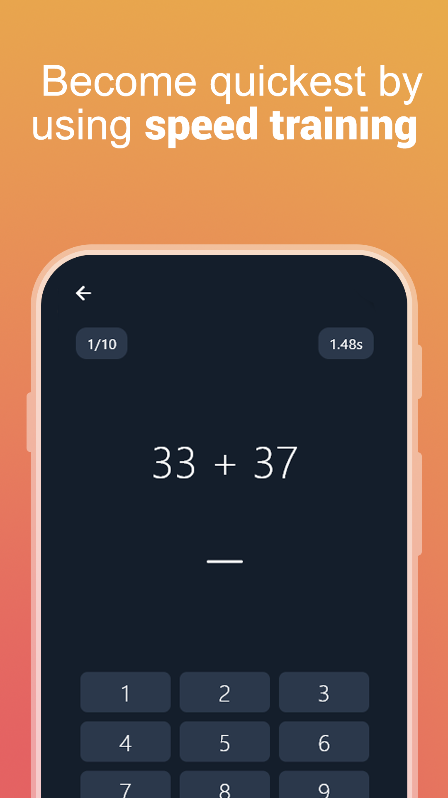
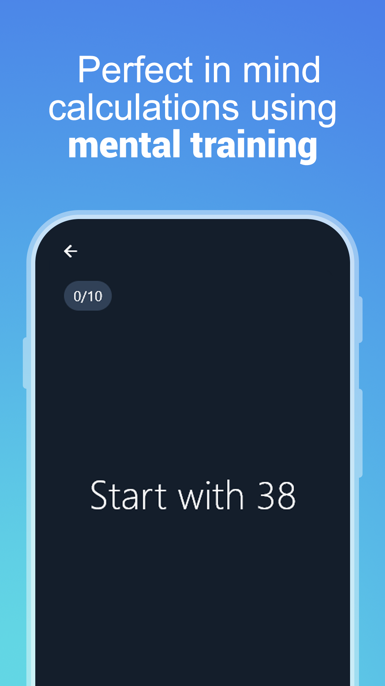
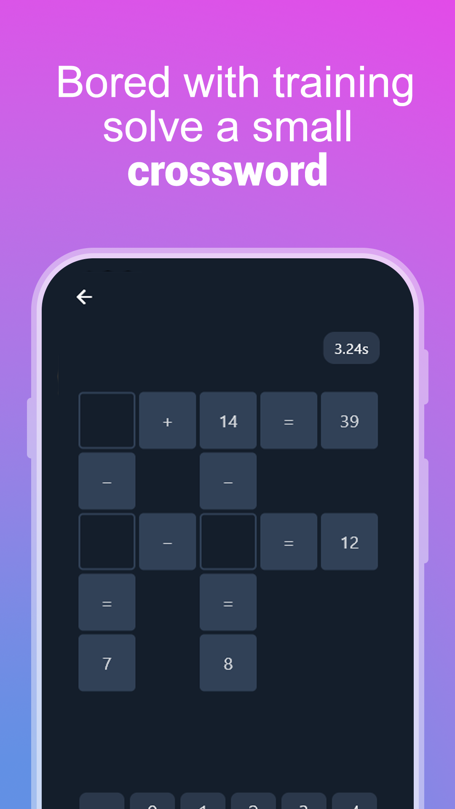
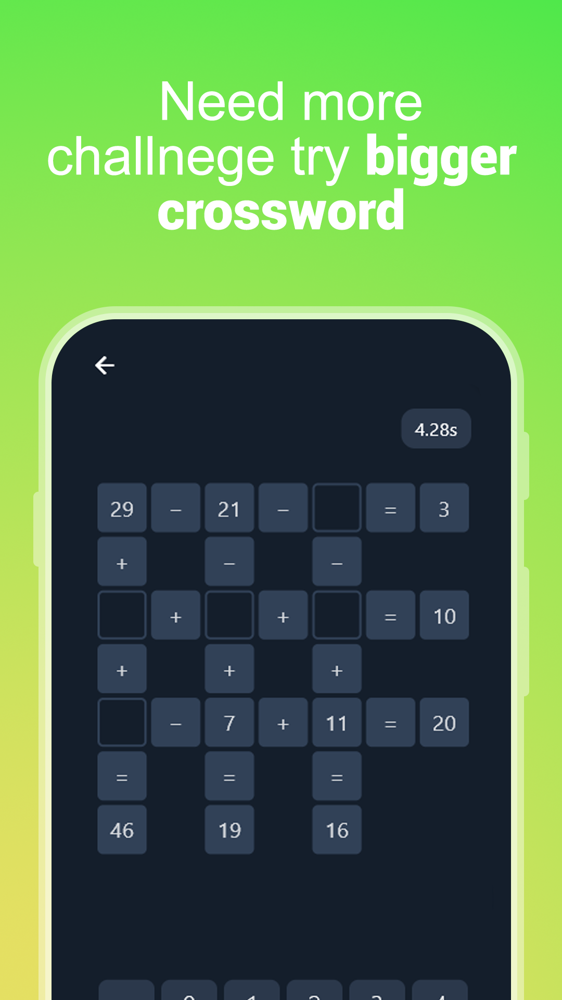
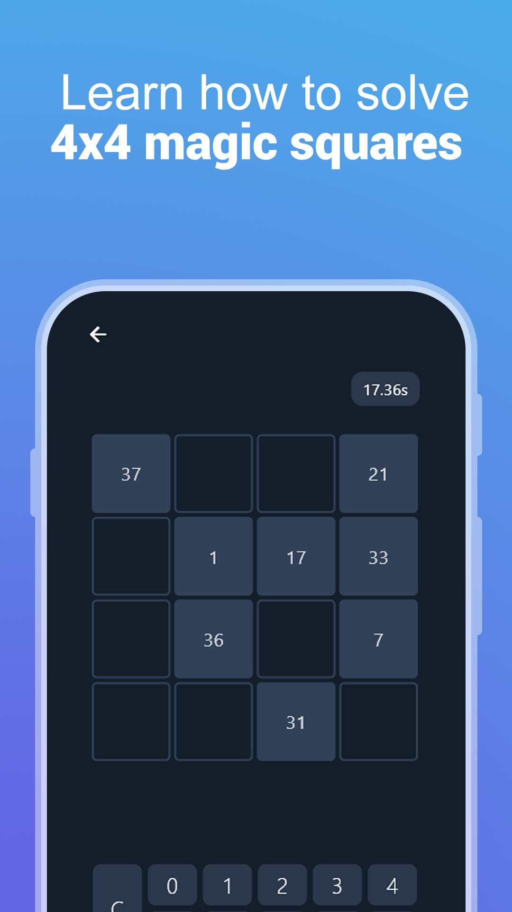

# Math IQ

**Math IQ** is a simple app created to explore and learn Flutter development. It offers a variety of engaging math-based exercises to sharpen your brain and improve your mental agility.

## Features

- 🧠 **Speed Training** – Solve quick math problems under time pressure.
- 🧮 **Memory Training** – Boost your memory with number pattern challenges.
- 🔲 **Magic Squares** – Solve classic magic square puzzles.
- ✖️ **Math Crosswords** – Fun and challenging math crosswords.

## Screenshots

  
  
  

  
  
  

## Download
App can be found on google play store https://play.google.com/store/apps/details?id=com.beturapps.math_training
